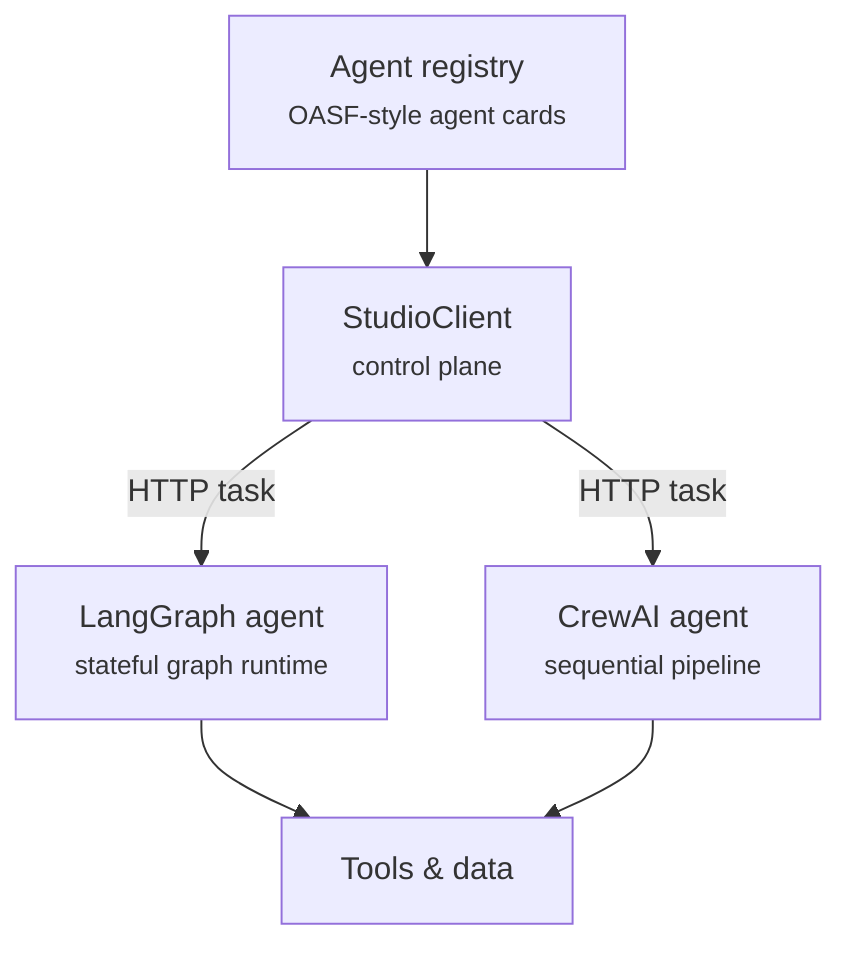

# agentstudio

A thin control plane for meshing agents across frameworks — LangGraph, CrewAI,
and anything else — without rewriting a single one of them.

## The idea

Most attempts at a universal "Agent Studio" try to be a **compiler**: write
one workflow definition, compile it into LangGraph's graph, CrewAI's
pipeline, or whatever runtime you're targeting. That runs into a real
problem — LangGraph is a stateful, cyclic graph; CrewAI is a deterministic,
sequential pipeline. Force both into one schema and you flatten exactly what
makes each one useful.

`agentstudio` takes the other approach — a **mesh**, not a compiler. Each
agent keeps running in its native framework, unmodified. It gets wrapped
behind a small HTTP surface modeled loosely on the [A2A protocol][a2a]'s task
lifecycle and [OASF][oasf]'s agent cards. A lightweight client then routes
work to any agent by URL, without knowing or caring what's running behind it.

[a2a]: https://a2a-protocol.org/
[oasf]: https://github.com/agntcy/oasf



## What this is — and isn't

This is a small, working illustration of the mesh pattern, not a certified
implementation of any spec:

- The HTTP surface is **inspired by** A2A's task lifecycle and agent cards,
  not a conformance-tested A2A implementation.
- The registry is **inspired by** OASF's idea of a discoverable agent card,
  not the OASF schema server.
- The MVP server runs tasks **synchronously** — no streaming, no async task
  queue yet. `Task.status` is already there so that upgrade is additive, not
  a breaking change.

If you need real interoperability with other A2A- or OASF-speaking systems,
start from their reference implementations. This project exists to make the
*architectural idea* concrete and runnable in an afternoon, not to replace
the specs.

## Install

```bash
pip install agentstudio          # core
pip install agentstudio[langgraph]   # + LangGraph adapter
pip install agentstudio[crewai]      # + CrewAI adapter
```

## Quickstart

Run the dependency-free example agent:

```bash
uvicorn examples.echo_agent:app --port 8001
```

Talk to it from another terminal, without agentstudio caring what's behind
that URL:

```bash
agentstudio call http://localhost:8001 --input '{"hello": "world"}'
```

Or from Python:

```python
from agentstudio import StudioClient

client = StudioClient()
card = client.get_agent_card("http://localhost:8001")
task = client.call("http://localhost:8001", {"hello": "world"})
print(task.output)  # {'echo': {'hello': 'world'}}
```

## Wrapping a real agent

Wrapping an existing LangGraph graph or CrewAI crew is one function call —
`agentstudio` never touches the graph, the state schema, or the crew's
agents and tasks:

```python
# LangGraph
from agentstudio import AgentCard, create_agent_server
from agentstudio.adapters.langgraph_adapter import wrap_langgraph

compiled = my_state_graph.compile()          # your graph, unmodified
card = AgentCard(id="my-agent", name="My agent", framework="langgraph",
                  skills=["research"], endpoint="http://localhost:8002")
app = create_agent_server(card, wrap_langgraph(compiled))
```

```python
# CrewAI
from agentstudio import AgentCard, create_agent_server
from agentstudio.adapters.crewai_adapter import wrap_crewai

card = AgentCard(id="my-crew", name="My crew", framework="crewai",
                  skills=["summarization"], endpoint="http://localhost:8003")
app = create_agent_server(card, wrap_crewai(my_crew))   # your crew, unmodified
```

Run either with `uvicorn <module>:app --port <port>` and it's part of the
mesh — discoverable via its agent card, callable by any `StudioClient`.

See [`examples/`](examples/) for complete, runnable versions of both.

## Registry

```python
from agentstudio import Registry, AgentCard

reg = Registry("agent_registry.json")
reg.register(AgentCard(id="my-agent", name="My agent", framework="langgraph",
                        skills=["research"], endpoint="http://localhost:8002"))

reg.find_by_skill("research")   # -> [AgentCard(...)]
```

```bash
agentstudio list --registry agent_registry.json
```

## Development

```bash
pip install -e ".[dev,langgraph,crewai]"
pytest
```

## Roadmap

- [ ] Async task execution + polling (server already models `TaskStatus`)
- [ ] Signed agent cards (A2A's security-card-signing model)
- [ ] A registry backend beyond a single JSON file
- [ ] An adapter for the Microsoft Agent Framework

## License

MIT — see [LICENSE](LICENSE).
